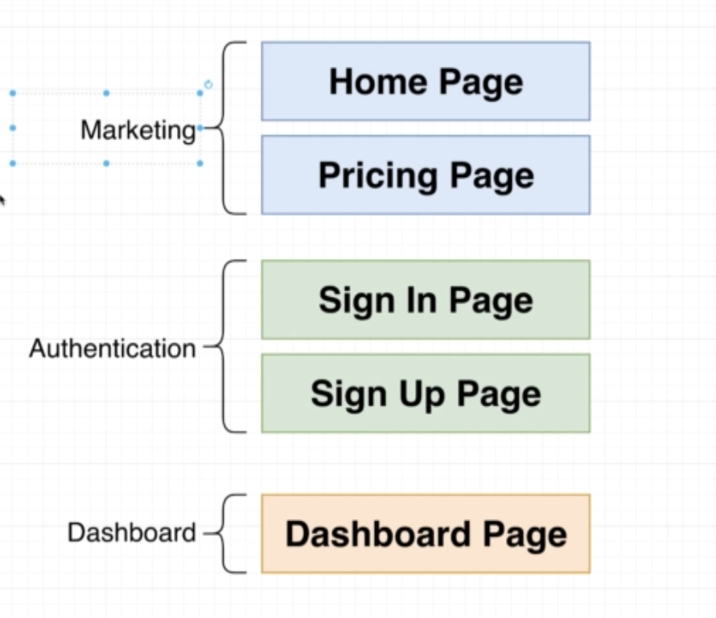
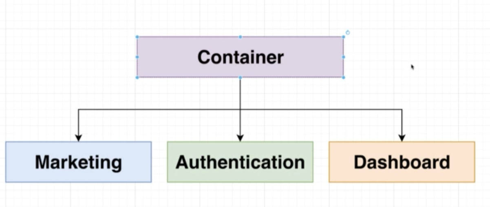
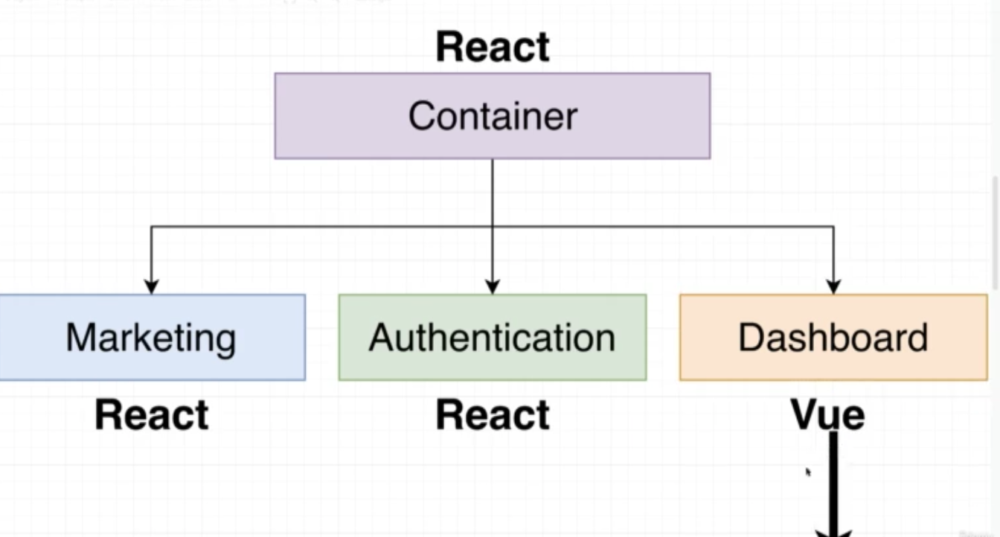
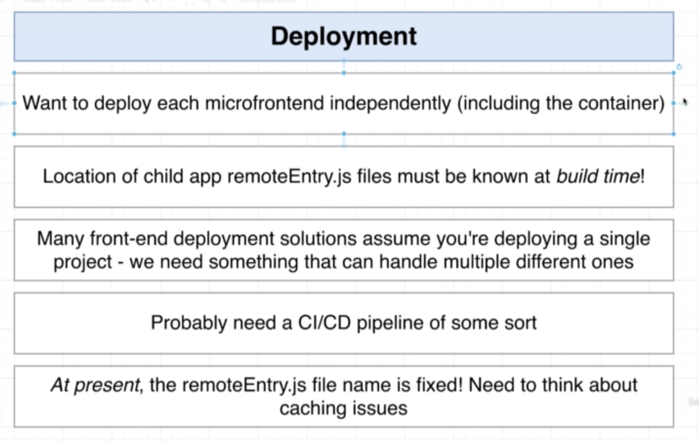
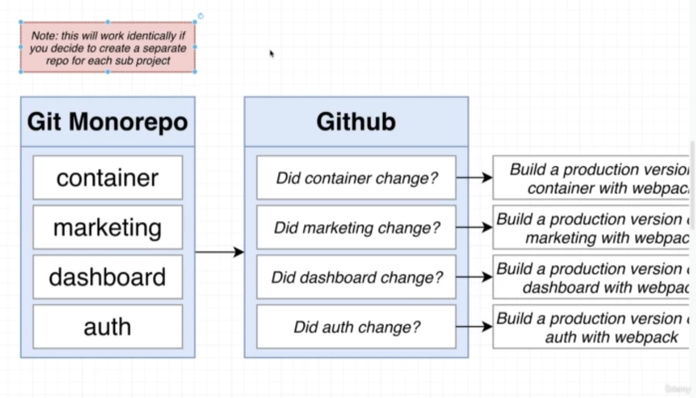

# Microfrontend - Phase2

## Project Stracture 

    - Homepage 
    - Pricing Page
    - Sign in Page
    - Sign UP Page
    - Dashborad Page

## Project Team

## Tech Stack

## Project Requirement

### Requirement -1
    - Zero coupling between child project
        - No importing of functions/objects/classes etc
        - No share state
        - Shared libraries through MF (ModuleFederationPlugin) is recommended
### Requirement -2
    - Zero coupling between contianer and child apps
        - Contianer shouldn't assume that child is using a particular framework
        - Any necessary communication done with callback or simple events

### Requirement -3
    - CSS from one project shouldn't affect another

### Requirement -4
    - Should not any impact on version control (monorepo vs seperate)

## Deployment

### Requirement

### Repo info

